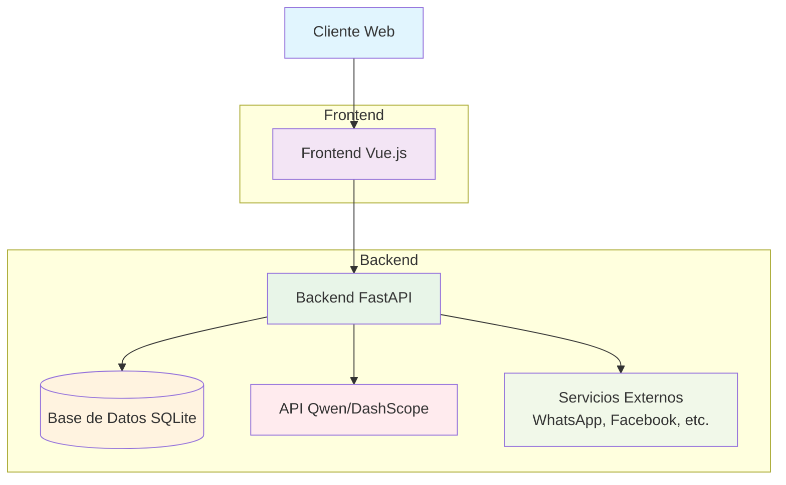

# SCAIE - Sistema Conversacional de Atención e Inteligencia Empresarial

## 📋 Índice
- [Descripción](#descripción)
- [Características](#características)
- [Arquitectura](#arquitectura)
- [Inicio Rápido](#inicio-rápido)
- [Estructura del Proyecto](#estructura-del-proyecto)
- [Tecnologías](#tecnologías)
- [API](#api)
- [Despliegue](#despliegue)
- [Contribución](#contribución)
- [Licencia](#licencia)

## 📖 Descripción

SCAIE (Sistema Conversacional de Atención e Inteligencia Empresarial) es una plataforma de agente conversacional con una arquitectura "Agent-Centric" donde el agente de IA es el actor principal del sistema.

## 🌟 Características

- 🤖 Agente de ventas automatizadas con inteligencia artificial
- 💬 Interfaz de chat en tiempo real
- 📇 Gestión de contactos y clientes potenciales
- 📊 Panel de control con estadísticas y métricas
- ⚙️ Configuración personalizable del agente
- 🌐 Integración con múltiples canales (WhatsApp, Facebook, etc.)
- 📱 Interfaz responsive y moderna

## 🏗️ Arquitectura

La arquitectura sigue un paradigma "Agent-Centric Design" donde:

- El agente de IA es el actor principal del sistema
- Backend (Python/FastAPI) proporciona una plataforma de operación, monitoreo y desarrollo (M&D)
- Frontend (Vue.js) actúa como interfaz de operaciones y depuración (Control Tower)
- Se utiliza Qwen AI (Alibaba Cloud) para el procesamiento de lenguaje natural



## 🚀 Inicio Rápido

### Prerrequisitos
- Python 3.10+
- Node.js 14+
- npm o yarn

### Ejecutar el Sistema Localmente

```bash
# Clonar el repositorio
git clone <repositorio>

# Navegar al directorio del proyecto
cd plataforma_agente_scaie
```

### Versión mejorada (recomendada)

```bash
# Dar permisos de ejecución al script
chmod +x build_and_run.sh

# Ejecutar el sistema con las mejoras UX/UI
./build_and_run.sh
```

### Versión original

```bash
# Dar permisos de ejecución al script
chmod +x run_local.sh

# Ejecutar el sistema
./run_local.sh
```

El sistema estará disponible en:
- Frontend: http://localhost:8001/
- API: http://localhost:8001/api
- Documentación interactiva: http://localhost:8001/docs

### Ejecutar el Sistema Localmente con Acceso en Línea (ngrok)

Para ejecutar el sistema localmente y permitir acceso en línea a través de ngrok:

```bash
# Navegar al directorio del proyecto
cd plataforma_agente_scaie

# Dar permisos de ejecución al nuevo script
chmod +x run_with_ngrok.sh

# Ejecutar el sistema con ngrok
./run_with_ngrok.sh
```

El sistema estará disponible en:
- Localmente: http://localhost:8001/
- En línea: La URL será mostrada por ngrok en la consola o puedes acceder a http://localhost:4040 para ver la URL pública

## 📁 Estructura del Proyecto

```
plataforma_agente_scaie/
├── backend/                 # Backend de la aplicación (FastAPI)
│   ├── app/                 # Código fuente del backend
│   │   ├── api/             # Endpoints de la API
│   │   ├── core/            # Configuración central (DB, seguridad)
│   │   ├── models/          # Modelos de datos (SQLAlchemy)
│   │   ├── schemas/         # Esquemas de validación (Pydantic)
│   │   ├── services/        # Lógica de negocio
│   │   └── main.py          # Punto de entrada de la aplicación
│   ├── requirements.txt     # Dependencias del backend
│   └── scaie.db             # Base de datos SQLite
├── frontend/                # Frontend de la aplicación (Vue.js)
│   ├── src/                 # Código fuente del frontend
│   │   ├── components/      # Componentes reutilizables
│   │   │   ├── agent/       # Componentes del agente
│   │   │   ├── chat/        # Componentes del chat
│   │   │   ├── contacts/    # Componentes de contactos
│   │   │   ├── dashboard/   # Componentes del dashboard
│   │   │   └── shared/      # Componentes compartidos
│   │   ├── composables/     # Composables de Vue (lógica reutilizable)
│   │   ├── router/          # Configuración de rutas
│   │   ├── services/        # Servicios (API client)
│   │   ├── views/           # Vistas principales
│   │   ├── App.vue          # Componente raíz
│   │   └── main.js          # Punto de entrada
│   ├── index.html           # Plantilla HTML
│   └── package.json         # Dependencias del frontend
├── README.md                # Este archivo
└── LICENSE                  # Licencia del proyecto
```

## 💻 Tecnologías

- **Backend**: Python 3.9+, FastAPI, SQLite, SQLAlchemy
- **Frontend**: Vue 3 (Composition API), Vite, TailwindCSS
- **IA**: Qwen (Dashscope API)
- **Autenticación**: JWT (en desarrollo)
- **Despliegue**: Docker (opcional)

## 🔌 API

La API está documentada con Swagger/OpenAPI y está disponible en `/docs` cuando el servidor está corriendo.

### Endpoints principales

- `GET /api/agent/stats` - Estadísticas del agente
- `GET /api/contacts/` - Listar contactos
- `POST /api/contacts/` - Crear contacto
- `GET /api/contacts/{id}` - Obtener contacto por ID
- `PUT /api/contacts/{id}` - Actualizar contacto
- `DELETE /api/contacts/{id}` - Eliminar contacto
- `POST /api/contacts/import` - Importar contactos desde CSV/JSON
- `POST /api/chat/` - Chat con el agente

## 🚢 Despliegue

### Despliegue Local

1. Configurar variables de entorno en `.env`:
   ```
   DASHSCOPE_API_KEY=tu_api_key_de_qwen
   DATABASE_URL=sqlite:///./scaie.db
   ```

2. Instalar dependencias:
   ```bash
   # Backend
   pip install -r backend/requirements.txt
   
   # Frontend
   cd frontend && npm install
   ```

3. Construir el frontend:
   ```bash
   cd frontend
   npm run build
   ```

4. Ejecutar el servidor:
   ```bash
   cd backend
   uvicorn app.main:app --host 0.0.0.0 --port 8001
   ```

### Despliegue con Docker (opcional)

```bash
# Construir y ejecutar con docker-compose
docker-compose up --build
```

## 🤝 Contribución

1. Fork del repositorio
2. Crear rama de características (`git checkout -b feature/NuevaFuncionalidad`)
3. Commit de cambios (`git commit -m 'Añadir nueva funcionalidad'`)
4. Push a la rama (`git push origin feature/NuevaFuncionalidad`)
5. Abrir Pull Request

## 📄 Licencia

Este proyecto está licenciado bajo la Licencia MIT - ver el archivo [LICENSE](LICENSE) para más detalles.