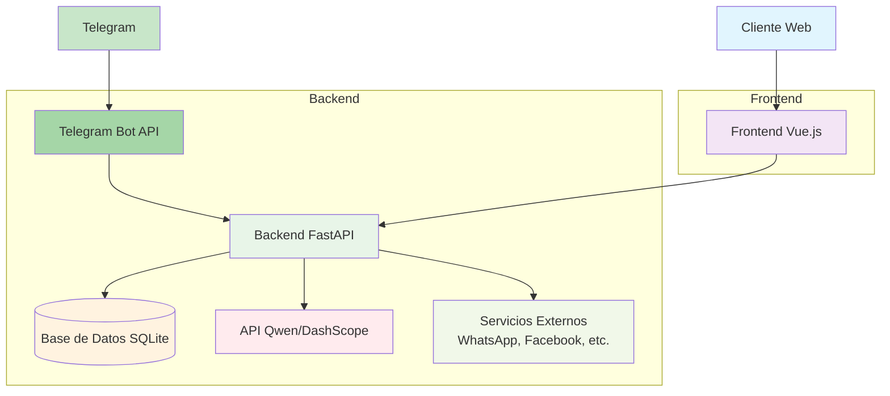

# SCAIE - Sistema Agente Conversacional Inteligente Empresarial

## 📦 Versión 2.1.0 - Sistema completamente funcional con integración Telegram

SCAIE (Sistema Agente Conversacional Inteligente Empresarial) es una plataforma avanzada de ventas automatizadas impulsada por inteligencia artificial. Esta solución permite a las empresas automatizar sus procesos de ventas y atención al cliente mediante un agente conversacional inteligente capaz de interactuar con clientes potenciales a través de múltiples canales.

## 📋 Índice
- [Versión del Sistema](#versión-del-sistema)
- [Descripción](#descripción)
- [Características Principales](#características-principales)
- [Arquitectura del Sistema](#arquitectura-del-sistema)
- [Requisitos del Sistema](#requisitos-del-sistema)
- [Instalación](#instalación)
- [Ejecución](#ejecución)
- [Uso del Sistema](#uso-del-sistema)
- [Integración con Telegram](#integración-con-telegram)
- [Estructura del Proyecto](#estructura-del-proyecto)
- [Tecnologías](#tecnologías)
- [API Endpoints](#api-endpoints)
- [Despliegue](#despliegue)
- [Contribución](#contribución)
- [Licencia](#licencia)
- [Contacto](#contacto)

## 📌 Versión del Sistema

**Versión Actual**: 2.1.0 - Sistema completamente funcional con integración Telegram  
**Fecha de Lanzamiento**: 2025-08-04

## 🌟 Características Principales

- **Agente Conversacional AI**: Impulsado por Qwen AI (Alibaba Cloud) para interacciones naturales y efectivas
- **Gestión de Contactos**: Sistema completo para administrar clientes potenciales con diferentes niveles de interés
- **Panel de Control**: Visualización en tiempo real de KPIs y métricas de ventas
- **Integración Multi-canal**: WhatsApp, Facebook Messenger, Telegram y web
- **Sistema de Conversaciones Persistente**: Almacena todas las interacciones en una base de datos SQLite
- **Importación/Exportación de Datos**: Facilita la migración de contactos desde otros sistemas
- **Agente Todopoderoso**: Capaz de realizar cualquier acción en el sistema, desde consultar la base de datos hasta agendar citas
- **Sistema de Tareas Automatizadas**: Gestión completa de tareas de seguimiento con prioridades y fechas límite
- **Detección Inteligente de Intenciones**: Identifica automáticamente las intenciones de los clientes y responde adecuadamente

## 🏗️ Arquitectura del Sistema

### Backend (Python / FastAPI)
- API RESTful para todas las operaciones del sistema
- Base de datos SQLite para almacenamiento persistente
- Integración con Qwen AI para procesamiento de lenguaje natural
- Sistema de conversaciones con contexto persistente
- Servicios para gestión de contactos y estadísticas
- Agente todopoderoso capaz de realizar cualquier acción en el sistema
- Sistema de tareas automatizadas para seguimiento de clientes
- Integración con Telegram Bot API

### Frontend (Vue.js 3 / Vite)
- Interfaz moderna y responsive construida con Vue.js 3
- Componentes organizados por dominios funcionales
- Sistema de rutas para navegación entre secciones
- Conexión en tiempo real con el backend
- Visualización de datos mediante gráficos y tablas
- Gestión completa de contactos con diferentes niveles de interés

### Componentes Principales

1. **Dashboard**: Panel de control con KPIs y métricas del sistema
2. **Base de Datos**: Gestión completa de contactos y clientes
3. **Chat de Pruebas**: Entorno para probar interacciones con el agente
4. **Configuración del Agente**: Personalización del comportamiento del agente

## Mejoras recientes en el Agente Conversacional

Hemos mejorado significativamente el agente conversacional para que proporcione respuestas más relevantes, útiles y humanas:

1. **Integración completa con Qwen AI**:
   - El agente ahora utiliza la API real de Qwen de Alibaba Cloud para generar respuestas
   - Implementamos clientes tanto síncronos como asíncronos para diferentes contextos de uso
   - Las respuestas son ahora generadas por inteligencia artificial en lugar de respuestas predefinidas

2. **Personalidad definida para el agente**:
   - SCAI tiene una personalidad profesional, experta en ventas y directa
   - Utiliza un tono profesional y conversacional sin emojis
   - Proporciona respuestas concisas y naturales

3. **Respuestas mejoradas sobre SCAIE**:
   - El agente puede explicar claramente qué es SCAIE basándose en la información real del sitio web
   - Proporciona información detallada sobre los servicios ofrecidos
   - Responde adecuadamente preguntas sobre precios y planes

4. **Detección mejorada de intenciones**:
   - Reconoce preguntas sobre precios incluso con diferentes formulaciones
   - Identifica correctamente solicitudes de información sobre servicios
   - Responde apropiadamente a saludos y presentaciones

5. **Persistencia de datos mejorada**:
   - Todas las interacciones se almacenan correctamente en la base de datos
   - Se crean contactos automáticamente cuando se inicia una conversación
   - Las estadísticas del sistema se actualizan en tiempo real

6. **Agente Todopoderoso**:
   - Capaz de realizar cualquier acción en el sistema
   - Puede consultar la base de datos, enviar materiales, agendar sesiones, generar cotizaciones
   - Detecta automáticamente qué acciones tomar según el contexto de la conversación
   - Mantiene un registro completo de todas las interacciones y acciones



## 🧪 Requisitos del Sistema

- Python 3.9+
- Node.js 14+
- npm 6+
- SQLite 3+

## 🚀 Instalación

### 1. Clonar el repositorio

```bash
git clone <url-del-repositorio>
cd plataforma_agente_scaie
```

### 2. Configurar el entorno backend

```bash
# Crear entorno virtual
python -m venv venv

# Activar entorno virtual (Linux/Mac)
source venv/bin/activate

# Activar entorno virtual (Windows)
venv\Scripts\activate

# Instalar dependencias
pip install -r backend/requirements.txt
```

### 3. Configurar el entorno frontend

```bash
# Navegar al directorio frontend
cd frontend

# Instalar dependencias
npm install

# Volver al directorio principal
cd ..
```

### 4. Configurar variables de entorno

Crear un archivo `.env` en el directorio raíz con las siguientes variables:

```env
DASHSCOPE_API_KEY=tu_api_key_de_qwen
DATABASE_URL=sqlite:///./backend/scaie.db
TELEGRAM_BOT_TOKEN=tu_token_de_telegram
```

## ▶️ Ejecución

### Método 1: Ejecución manual

```bash
# En una terminal, iniciar el backend
cd backend
uvicorn app.main:app --host 0.0.0.0 --port 8001 --reload

# En otra terminal, iniciar el frontend
cd frontend
npm run dev
```

### Método 2: Ejecución con script (recomendado)

```bash
# Ejecutar el script de construcción y ejecución mejorado
./run_scaie.sh
```

### Método 3: Ejecución con script original (mantenido para compatibilidad)

```bash
# Ejecutar el script de construcción y ejecución original
./build_and_run.sh
```

## 💡 Uso del Sistema

Una vez iniciado el sistema, puedes acceder a través de tu navegador en `http://localhost:8001`

### Secciones Principales

1. **Dashboard (`/`)**: Vista general del sistema con KPIs y métricas
2. **Base de Datos (`/database`)**: Gestión completa de contactos
3. **Chat de Pruebas (`/chat`)**: Interacción con el agente AI
4. **Sandbox (`/sandbox`)**: Pruebas avanzadas del agente con configuración personalizada

## 📱 Integración con Telegram

SCAIE ahora incluye integración completa con Telegram, permitiendo a los usuarios interactuar con el agente a través de un bot de Telegram.

### Configuración

1. **Crear un bot de Telegram**:
   - Habla con [@BotFather](https://t.me/BotFather) en Telegram
   - Usa el comando `/newbot` para crear un nuevo bot
   - Sigue las instrucciones para obtener tu token de acceso

2. **Configurar el token**:
   - Agrega `TELEGRAM_BOT_TOKEN=your_token_here` a tu archivo `.env`

3. **Iniciar el sistema**:
   - Ejecuta `./run_scaie.sh`
   - El bot de Telegram se iniciará automáticamente

### Funcionalidades

- **Comandos disponibles**:
  - `/start` - Mensaje de bienvenida e introducción
  - `/help` - Información sobre las capacidades del bot

- **Interacciones**:
  - El bot reconoce automáticamente las intenciones de los usuarios
  - Puede proporcionar información sobre servicios
  - Detecta interés y actualiza el nivel de interés del contacto
  - Puede agendar citas y enviar materiales (funcionalidad en desarrollo)

- **Seguimiento**:
  - Todas las interacciones se almacenan en la base de datos
  - Los contactos se identifican por su ID de usuario de Telegram
  - El historial de conversaciones se mantiene para contexto

## 📁 Estructura del Proyecto

```
plataforma_agente_scaie/
├── backend/                 # Backend de la aplicación (FastAPI)
│   ├── app/                 # Código fuente del backend
│   │   ├── api/             # Endpoints de la API
│   │   │   ├── endpoints/   # Endpoints individuales
│   │   │   └── api.py       # Enrutador principal
│   │   ├── core/            # Configuración central (DB, seguridad)
│   │   ├── models/          # Modelos de datos (SQLAlchemy)
│   │   ├── schemas/         # Esquemas de validación (Pydantic)
│   │   ├── services/        # Lógica de negocio
│   │   └── main.py          # Punto de entrada de la aplicación
│   ├── requirements.txt     # Dependencias del backend
│   ├── scaie.db             # Base de datos SQLite
│   └── init_db.py           # Script de inicialización de base de datos
├── frontend/                # Frontend de la aplicación (Vue.js)
│   ├── src/                 # Código fuente del frontend
│   │   ├── components/      # Componentes reutilizables
│   │   │   ├── agent/       # Componentes del agente
│   │   │   ├── chat/        # Componentes del chat
│   │   │   ├── contacts/    # Componentes de contactos
│   │   │   ├── dashboard/   # Componentes del dashboard
│   │   │   └── shared/      # Componentes compartidos
│   │   ├── composables/     # Composables de Vue (lógica reutilizable)
│   │   ├── router/          # Configuración de rutas
│   │   ├── services/        # Servicios (API client)
│   │   ├── views/           # Vistas principales
│   │   ├── App.vue          # Componente raíz
│   │   └── main.js          # Punto de entrada
│   ├── index.html           # Plantilla HTML
│   └── package.json         # Dependencias del frontend
├── README.md                # Este archivo
├── LICENSE                  # Licencia del proyecto
├── run_scaie.sh             # Script de ejecución mejorado (recomendado)
├── build_and_run.sh         # Script de ejecución original (compatibilidad)
└── .env.example             # Ejemplo de archivo de configuración
```

## 💻 Tecnologías

- **Backend**: Python 3.9+, FastAPI, SQLite, SQLAlchemy
- **Frontend**: Vue 3 (Composition API), Vite, TailwindCSS
- **IA**: Qwen (Dashscope API)
- **Autenticación**: JWT (en desarrollo)
- **Despliegue**: Docker (opcional)
- **Telegram**: python-telegram-bot

## 📡 API Endpoints

- `GET /api/agent/stats` - Estadísticas del agente
- `GET /api/contacts/` - Listar contactos
- `POST /api/contacts/` - Crear contacto
- `PUT /api/contacts/{id}` - Actualizar contacto
- `DELETE /api/contacts/{id}` - Eliminar contacto
- `POST /api/chat/` - Interactuar con el agente
- `POST /api/chat/sandbox` - Interactuar con el agente en modo sandbox
- `POST /api/contacts/import` - Importar contactos
- `GET /api/conversations/` - Listar conversaciones
- `POST /api/conversations/` - Crear conversación
- `GET /api/conversations/{id}` - Obtener conversación por ID
- `POST /api/omnipotent-agent/process-message` - Procesar mensaje con el agente todopoderoso
- `POST /api/omnipotent-agent/execute-pending-actions/{conversation_id}` - Ejecutar acciones pendientes
- `GET /api/omnipotent-agent/contact/{contact_id}/summary` - Obtener resumen de contacto
- `GET /api/omnipotent-agent/search-contacts` - Buscar contactos
- `POST /api/omnipotent-agent/tasks` - Crear tarea
- `PUT /api/omnipotent-agent/tasks/{task_id}` - Actualizar tarea
- `DELETE /api/omnipotent-agent/tasks/{task_id}` - Eliminar tarea
- `GET /api/omnipotent-agent/tasks` - Listar tareas

## 🚢 Despliegue

### Despliegue Local

1. Configurar variables de entorno en `.env`:
   ```
   DASHSCOPE_API_KEY=tu_api_key_de_qwen
   DATABASE_URL=sqlite:///./scaie.db
   TELEGRAM_BOT_TOKEN=tu_token_de_telegram
   ```

2. Instalar dependencias:
   ```bash
   # Backend
   pip install -r backend/requirements.txt
   
   # Frontend
   cd frontend && npm install
   ```

3. Construir el frontend:
   ```bash
   cd frontend
   npm run build
   ```

4. Ejecutar el servidor:
   ```bash
   cd backend
   uvicorn app.main:app --host 0.0.0.0 --port 8001
   ```

### Despliegue con Docker (opcional)

```bash
# Construir y ejecutar con docker-compose
docker-compose up --build
```

## 🤝 Contribución

1. Fork del repositorio
2. Crear rama de características (`git checkout -b feature/NuevaFuncionalidad`)
3. Commit de cambios (`git commit -m 'Añadir nueva funcionalidad'`)
4. Push a la rama (`git push origin feature/NuevaFuncionalidad`)
5. Abrir Pull Request

## 📞 Contacto

Para más información, contacta con el equipo de desarrollo.

---

**Versión Actual**: 2.1.0 - Sistema completamente funcional con integración Telegram  
**Fecha de Lanzamiento**: 2025-08-04

## Funcionalidad del Agente Todopoderoso

El agente todopoderoso es una evolución del agente conversacional básico con capacidades extendidas:

### Características clave:
1. **Acceso completo al sistema**: Puede realizar cualquier operación en la base de datos
2. **Inteligencia avanzada**: Entiende todo el sistema y sabe qué hacer en cada situación
3. **Multicanal**: Recibe mensajes de WhatsApp, Meta, webchat, Telegram y otros canales
4. **Funcionalidad completa**:
   - Consultar el backend
   - Enviar materiales
   - Agendar sesiones
   - Generar cotizaciones
   - Escalar a humanos cuando sea necesario
5. **Gestión automática de tareas**: Crea y gestiona tareas basadas en las interacciones

### Objetivos del agente:
1. **Objetivo principal**: Vender el workshop "Sé más eficiente con IA"
2. **Objetivo secundario**: Detectar oportunidades para servicios de consultoría OPT

### Workshop "Sé más eficiente con IA":
- Duración: 2 a 4 horas
- Modalidad: Online en vivo o presencial
- Dirigido a: Empresas que aún usan procesos manuales, Excel, correo, etc.
- Incluye: Diagnóstico previo, workshop práctico, grabación, materiales y recomendaciones específicas
- Resultado esperado: Al menos tres herramientas activadas y un flujo operativo optimizado

## Mejoras y Recomendaciones Futuras

### Mejoras Implementadas en la Versión 2.1.0:

1. **Integración con Telegram**:
   - Servicio completo de bot de Telegram
   - Identificación de usuarios por ID de Telegram
   - Procesamiento de comandos y mensajes
   - Integración con el agente todopoderoso

2. **Script de ejecución mejorado**:
   - Verificación automática de variables de entorno
   - Inicialización automática de base de datos
   - Copia automática de archivos estáticos
   - Manejo de errores mejorado
   - Inicio automático del bot de Telegram

3. **Sistema de tareas automatizadas**:
   - Gestión completa de tareas con prioridades
   - Seguimiento de actividades pendientes
   - Asignación automática de tareas basadas en interacciones

4. **Agente todopoderoso**:
   - Capaz de realizar cualquier acción en el sistema
   - Detección automática de intenciones
   - Ejecución de acciones basadas en contexto

### Recomendaciones para Futuras Mejoras:

1. **Integración con WhatsApp Business API**:
   - Conectar el sistema con la API oficial de WhatsApp para comunicación en tiempo real
   - Implementar webhooks para recibir mensajes entrantes

2. **Sistema de notificaciones**:
   - Notificaciones por email cuando se crean tareas importantes
   - Alertas en tiempo real para acciones críticas

3. **Panel de administración avanzado**:
   - Roles de usuario (administrador, vendedor, supervisor)
   - Reportes avanzados y análisis de datos
   - Configuración de flujos de conversación personalizados

4. **Mejoras en la IA**:
   - Entrenamiento específico con datos del dominio
   - Personalización de respuestas según el perfil del cliente
   - Análisis de sentimiento en las conversaciones

5. **Integración con CRM**:
   - Conexión con sistemas CRM populares (HubSpot, Salesforce, etc.)
   - Sincronización automática de contactos y actividades

6. **Sistema de métricas avanzadas**:
   - Análisis de conversaciones para identificar patrones
   - Métricas de conversión detalladas por canal
   - Reportes personalizados

7. **Mejoras en la UI/UX**:
   - Tema oscuro
   - Interfaz móvil completamente responsive
   - Accesibilidad mejorada

8. **Seguridad**:
   - Autenticación JWT para la API
   - Encriptación de datos sensibles
   - Registro de auditoría de actividades

## 📄 Licencia

Este proyecto está licenciado bajo la Licencia MIT - ver el archivo [LICENSE](LICENSE) para más detalles.